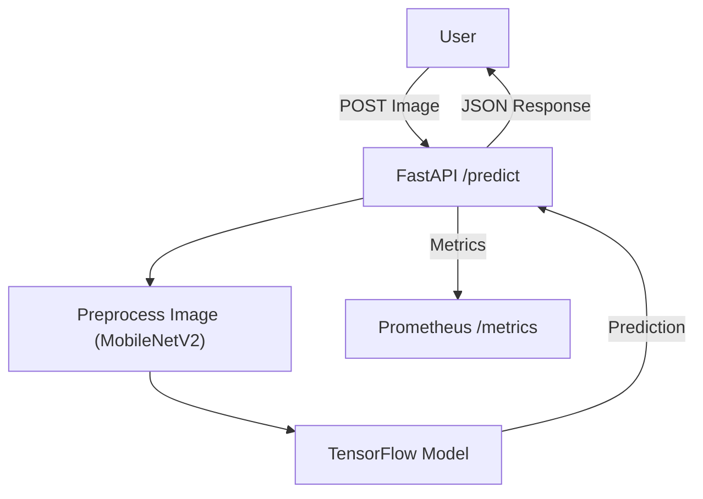
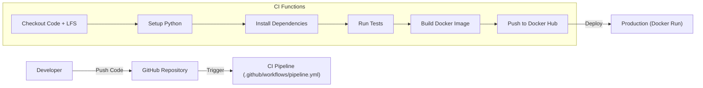

# 🐱 vs 🐶 MLOps Classification Pipeline


# Group 46

## Members

1. **Santhosh M** – 2024aa05161@wilp.bits-pilani.ac.in – 100% Contribution
2. **Shah Bhavin Arvindkumar Chandrikaben** – 2024aa05899@wilp.bits-pilani.ac.in – 100% Contribution
3. **Shailesh Narayan Wazalwar** – 2024aa05298@wilp.bits-pilani.ac.in – 100% Contribution
4. **Behara Kiran Kumar** – 2024aa05531@wilp.bits-pilani.ac.in – 100% Contribution
5. **Bhadriraju Prasanth** – 2024aa05717@wilp.bits-pilani.ac.in – 100% Contribution

## 📖 Executive Summary

This project implements a robust, end-to-end **MLOps pipeline** for binary image classification (Cats vs Dogs). It demonstrates industry best practices by integrating:

- **Transfer Learning** with MobileNetV2 for high-accuracy training.
- **Experiment Tracking** using MLflow.
- **Automated CI/CD** with GitHub Actions for testing and deployment.
- **Containerization** via Docker for consistent environments.
- **Observability** with Prometheus metrics and structured logging.

The system is designed to be **production-ready**, scalable, and easily maintainable.

---

## 🏗️ Architecture

### 🔄 Application Flow

The application follows a standard inference pattern:

1.  **User** sends an image to the API.
2.  **FastAPI** validates and pre-processes the image (MobileNetV2 standard).
3.  **TensorFlow Model** runs inference.
4.  **Prometheus** collects request latency and count metrics.



### 🚀 CI/CD Pipeline

Every push to `main` triggers the automated pipeline:

1.  **checkout**: Retrieves code and LFS artifacts (`model.h5`).
2.  **test**: Runs `pytest` for code quality and integration checks.
3.  **build**: Creates a Docker image containing the application and model.
4.  **deploy**: Pushes the image to Docker Hub (if secrets are present).



---

## 🛠️ Tech Stack

| Category            | Technology         | Description                              |
| :------------------ | :----------------- | :--------------------------------------- |
| **Language**        | Python 3.11        | Core programming language.               |
| **API**             | FastAPI            | High-performance async web framework.    |
| **ML Engine**       | TensorFlow / Keras | MobileNetV2 (Transfer Learning).         |
| **Tracking**        | MLflow             | Logs parameters, metrics, and artifacts. |
| **Container**       | Docker             | Distroless/Slim images for production.   |
| **CI/CD**           | GitHub Actions     | Automated testing and delivery.          |
| **Monitoring**      | Prometheus         | Real-time metrics scraping.              |
| **Version Control** | Git LFS            | Large File Storage for `*.h5` models.    |

---

## 📂 Project Structure

```bash
c:/dev/mlops
├── .github/workflows/    # 🤖 CI/CD definitions
├── app/                  # 🚀 FastAPI application
│   ├── main.py           #    - API Endpoints & Monitoring
├── src/                  # 🧠 ML Source Code
│   ├── train.py          #    - Training loop & Callbacks
│   ├── model.py          #    - MobileNetV2 Architecture
│   ├── preprocess.py     #    - Data Augmentation & Prep
├── tests/                # 🧪 Unit & Integration Tests
├── Dockerfile            # 🐳 Production Docker Image
├── docker-compose.yml    # 📦 Orchestration
├── requirements.txt      # 📦 Python Dependencies
├── smoke_test.py         # 🔍 Post-deployment Health Check
└── README.md             # 📄 Documentation
```

---

## 🚀 Setup & Installation

### Prerequisites

- Python 3.9+
- Docker & Docker Compose
- Git with **Git LFS** installed (`git lfs install`)

### 1. Clone & Configure

```bash
git clone <your-repo-url>
cd mlops
git lfs pull  # Download model artifacts
```

### 2. Local Environment

```bash
# Create virtual environment
python -m venv venv
source venv/bin/activate  # Windows: venv\Scripts\activate

# Install dependencies
pip install -r requirements.txt
```

### 3. Prepare Data

Download the [Kaggle Cats & Dogs Dataset](https://www.kaggle.com/c/dogs-vs-cats/data) and structure it as:

```text
Dataset/PetImages/
    ├── Cat/  [...images...]
    └── Dog/  [...images...]
```

---

## 🧠 Model Training

To retrain the model with new data or hyperparameters:

```bash
python -m src.train
```

**Training Features**:

- **EarlyStopping**: Prevents overfitting by halting training if validation loss doesn't improve.
- **ReduceLROnPlateau**: Automatically reduces learning rate for optimal convergence.
- **ModelCheckpoint**: Saves only the best performing model as `model.h5`.

**Generated Artifacts** (saved to `artifacts/` and logged to MLflow):

| Artifact                    | Description                              |
| :-------------------------- | :--------------------------------------- |
| `loss_curve.png`            | Training & Validation loss per epoch     |
| `accuracy_curve.png`        | Training & Validation accuracy per epoch |
| `confusion_matrix.png`      | Confusion matrix on the validation set   |
| `classification_report.txt` | Precision, Recall, F1-Score per class    |
| `model.h5`                  | Best performing model weights            |

---

## 📈 MLflow — Experiment Tracking

MLflow tracks every training run with parameters, metrics, and artifacts.

### Start MLflow UI

```bash
python -m mlflow ui
```

Then open **http://localhost:5000** in your browser.

### What You'll See

- **Runs Table**: Compare training runs side-by-side (accuracy, loss, etc.)
- **Metrics Charts**: Per-epoch loss and accuracy curves plotted automatically
- **Artifacts**: Download `confusion_matrix.png`, `loss_curve.png`, etc.
- **Parameters**: `epochs`, `batch_size`, `learning_rate`, `base_model`

> **Tip**: After training, click on a run → **Artifacts** tab to view the confusion matrix and training curves directly in the browser.

---

## �️ Model Serving (Local)

Start the FastAPI inference server locally:

```bash
python -m uvicorn app.main:app --reload
```

Once running, the following endpoints are available:

| Endpoint       | URL                                                        | Description                        |
| :------------- | :--------------------------------------------------------- | :--------------------------------- |
| **Swagger UI** | [http://localhost:8000/docs](http://localhost:8000/docs)   | Interactive API documentation      |
| **ReDoc**      | [http://localhost:8000/redoc](http://localhost:8000/redoc) | Alternative API docs               |
| **Predict**    | `POST http://localhost:8000/predict`                       | Upload an image for classification |
| **Health**     | `GET http://localhost:8000/health`                         | Health check                       |
| **Metrics**    | `GET http://localhost:8000/metrics`                        | Prometheus metrics                 |

> **Note**: Use `python -m uvicorn` instead of `uvicorn` directly if you get a "command not found" error.

---

## �🐳 Deployment (Docker)

### Build & Run Locally

```bash
docker-compose up --build -d
```

### Run Production Image

Pull the pre-built image from Docker Hub (updated via CI/CD):

```bash
docker run -p 8000:8000 msanthoshofficial/cat-dog-classifier:latest
```

### Verification

Run the smoke test to ensure the API, Model, and Metrics are healthy:

```bash
python smoke_test.py
```

---

## 🔌 API Documentation

### `POST /predict`

Classifies an uploaded image.

**Request**: `multipart/form-data`

- `file`: Image file (jpg, png)

**Response**:

```json
{
	"prediction": "Dog",
	"confidence": 0.98,
	"raw_score": 0.9845
}
```

### `GET /metrics`

Prometheus endpoints for observability.

- **request_count**: Total number of inference requests.
- **inference_latency**: Time taken for model prediction.

---

## ⚙️ CI/CD Configuration (GitHub Actions)

The pipeline is defined in `.github/workflows/pipeline.yml`.

### Secrets Required

To enable Docker Hub pushing, add these **Repository Secrets**:

- `DOCKER_USERNAME`
- `DOCKER_PASSWORD`

### Workflow Steps

1.  **LFS Checkout**: Ensures the 15MB+ model file is available.
2.  **Pytest**: Runs unit tests (if any) and checks file integrity.
3.  **Docker Build**: Uses `python:3.11-slim` for a small footprint.
4.  **Push**: Tags with `latest` and pushes to Docker Hub.

---

## 📊 Monitoring

The application is instrumented with `prometheus-fastapi-instrumentator`.

1.  **View Metrics**: Navigate to `http://localhost:8000/metrics`.
2.  **Integration**: Configure a Prometheus server to scrape this target:
    ```yaml
    scrape_configs:
        - job_name: "mlops-app"
          static_configs:
              - targets: ["host.docker.internal:8000"]
    ```

---

## 🤝 Contribution

1.  Fork the repository.
2.  Create a feature branch (`git checkout -b feature/amazing-feature`).
3.  Commit your changes.
4.  Push to the branch.
5.  Open a Pull Request.

---

## 📜 License

Distributed under the MIT License. See `LICENSE` for more information.
